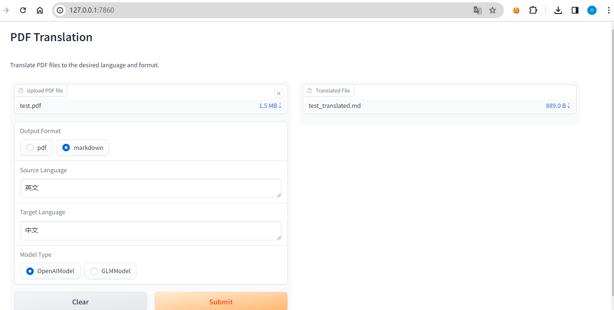
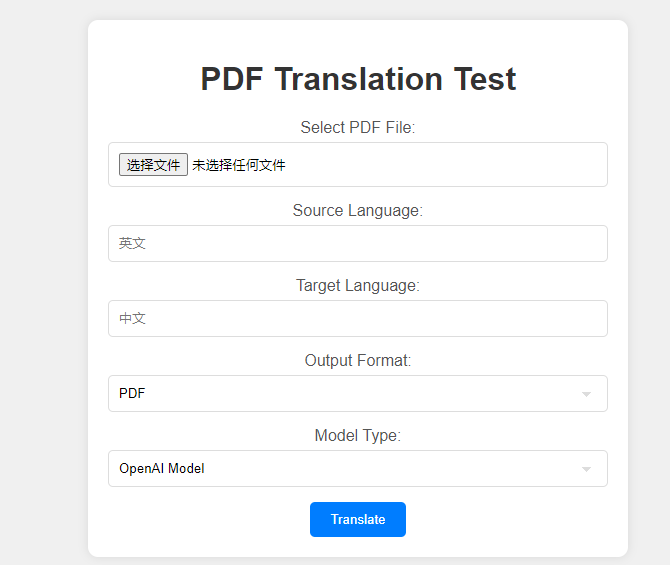

# 作业说明
实现 OpenAI-Translator V2.0 中的一个或多个特性

Feature List

1.支持图形用户界面（GUI），提升易用性。
2.添加对保留源 PDF 的原始布局的支持。
3.服务化：以 API 形式提供翻译服务支持。
4.添加对其他语言的支持。

# 完成说明
1.支持图形用户界面（GUI），提升易用性。
    测试入口：python .\ai_translator\gradio_gui.py
    使用gradio实现对函数用户交互页面的开发。
    
    也开发了html页面实现GUI，参见：“3.服务化"。

2.实现布局。
    实现思路：通过修改了writer.py 增加对pdf文本换行的支持。在pdf_parser.py中增加了layout参数。

3.服务化：以 API 形式提供翻译服务支持。
    测试入口：python .\ai_translator\api.py
    使用flask暴露对外服务api,服务地址为http://127.0.0.1:5000/api/translate
    可以通过地址 http://127.0.0.1:5000/test 来访问api。
    

4.增加对多种语言的支持。
    测试入口：python .\ai_translator\main.py --target_language  新疆文字 --file_format markdown
    通过扩展翻译函数的入参和prompt实现多语种翻译多语种翻译时，由于openai会对表格内容的逗号进行替换为其他符号，所以有时无法正确解析翻译后的表格。我通过增强prompt，加上one-shot举例，实现了表格的正确翻译与解析。

注意，您需要在操作系统环境变量中以及config.yaml 设置OPENAI_API_KEY
如果，你不需要代理可以删除代码片段再执行。如果需要
```python
    import socket
    import socks
    socks.set_default_proxy(socks.SOCKS5, "127.0.0.1", 10808)
    socket.socket = socks.socksocket
```