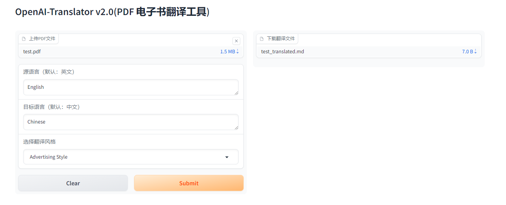
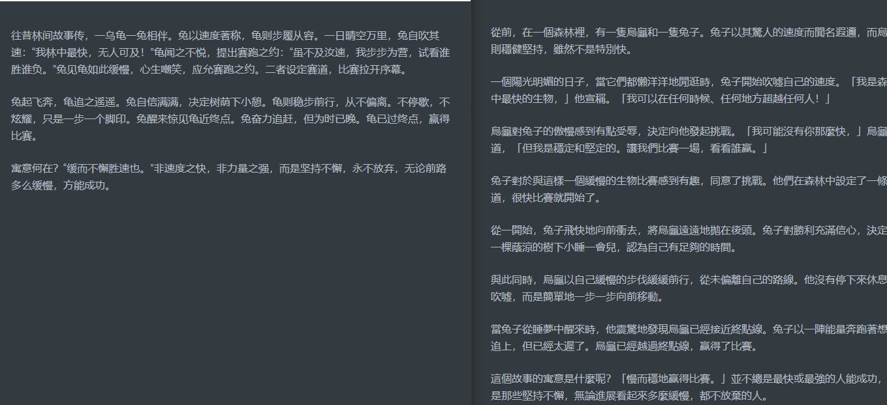

# 作业说明

三选一

在 openai-translator gradio 图形化界面基础上，支持风格化翻译，如：小说、新闻稿、作家风格等。

扩展销售机器人（sales_chatbot）项目，应用于不同的销售场景，如：电器、家装、教育等。

实现 LangChain 版本的 AutoGPT 项目的图形化界面。

# 完成情况

1、在 openai-translator gradio 图形化界面基础上，支持风格化翻译，如：小说、新闻稿、作家风格等。
   修改了 TranslationChain ，在prompt中增加翻译style。
   在 gradio中增加翻译风格的选项。
   
   龟兔赛跑的故事翻译，不同风格的效果
   
   注意，为了在国内实现访问openai，在代码中有部分需要修改，在translation_chain.py中部分代码
   ```python
      import os
      import socket
      import socks

      socks.set_default_proxy(socks.SOCKS5, "127.0.0.1", 10808)
      socket.socket = socks.socksocket
      os.environ['SERPAPI_API_KEY'] = 'YOUR SERPAPI_API_KEY'
      os.environ['OPENAI_API_KEY'] = 'YOUR_OPENAI_API_KEY'
   ```
