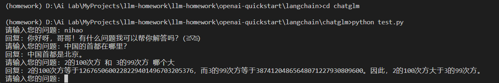
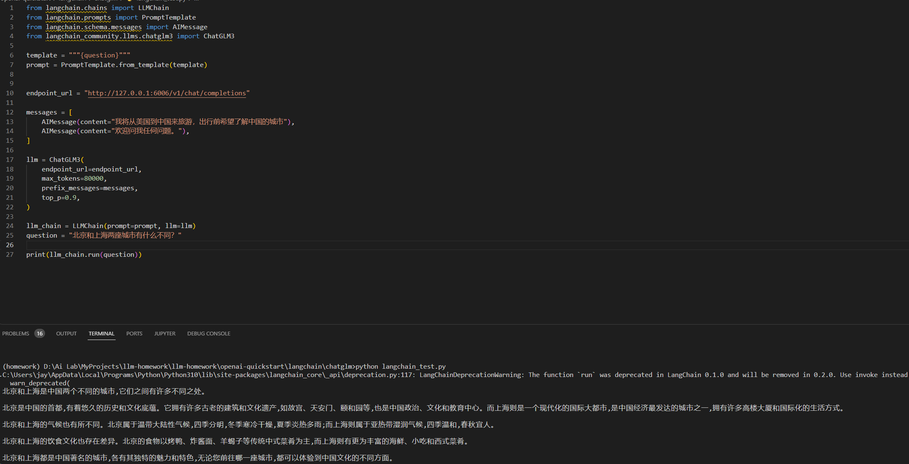
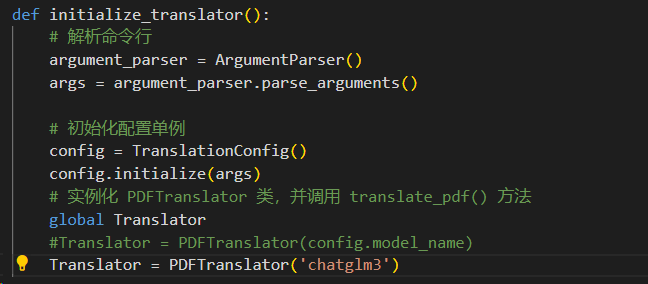
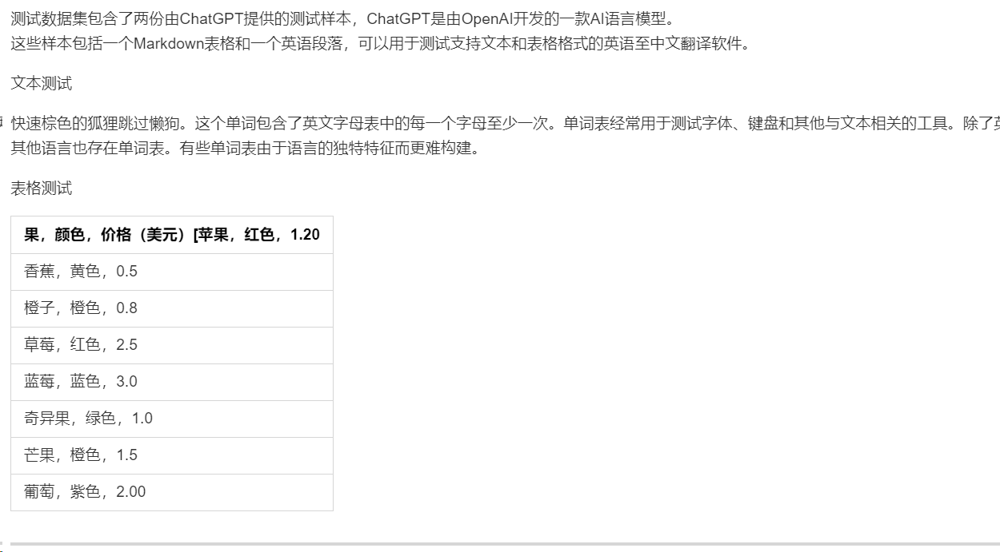

# 作业说明
基于 ChatGLM2-6B 实现带图形化界面的 openai-translator

# 完成情况

测试方法：cd llm-homework\openai-quickstart\langchain\openai-translator &  python ai_translator/gradio_server.py
实现路径：
1、使用了autodl算力云平台，租赁云平台并部署了chatglm3，对外提供了api服务。

2、测试与chatglm3的通信，在openai-quickstart\langchain\chatglm路径下，test.py通过并实现了api的测试；langchain_test.py通过了与langchain搭配，实现了langchain对chatglm3的调用。

3、使用chatglm进行翻译。
    在langchain/openai-translator/ai_translator目录下，修改translator/translation_chain.py，增加对chatglm模型的生成调用
    ```python
            # 为了翻译结果的稳定性，将 temperature 设置为 0
            if(model_name=="gpt-3.5-turbo"):
                chat = ChatOpenAI(model_name=model_name, temperature=0, verbose=verbose)
            else:
                chat = ChatGLM3(endpoint_url="http://127.0.0.1:6006/v1/chat/completions",max_tokens=80000,top_p=0.9, temperature=0, verbose=verbose)
    ```
4、修改gradio_server.py,强制指定模型名称，为了保证作业2也能进行测试，对该段代码做了注释。

5、翻译效果如下
